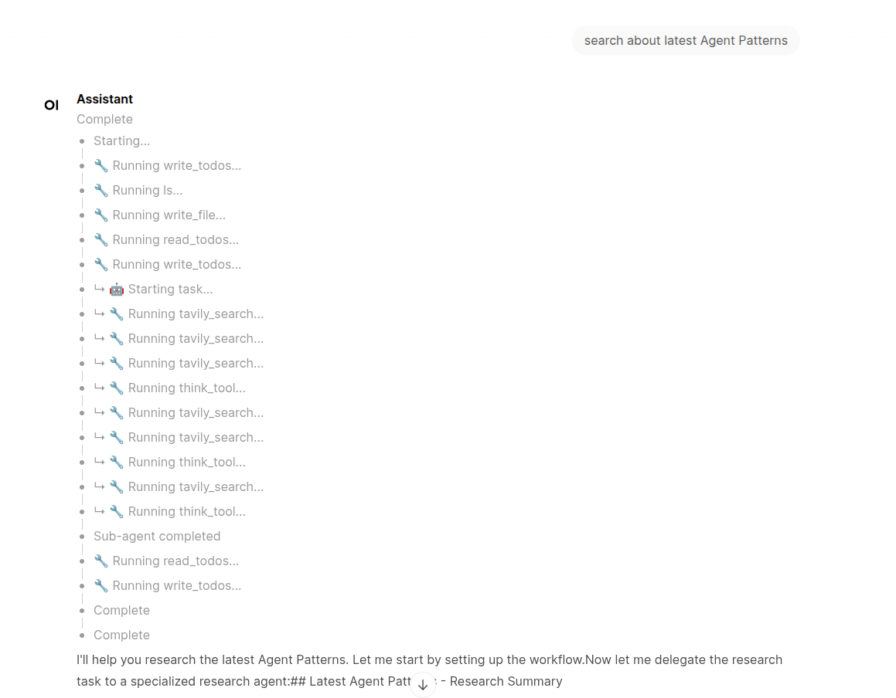
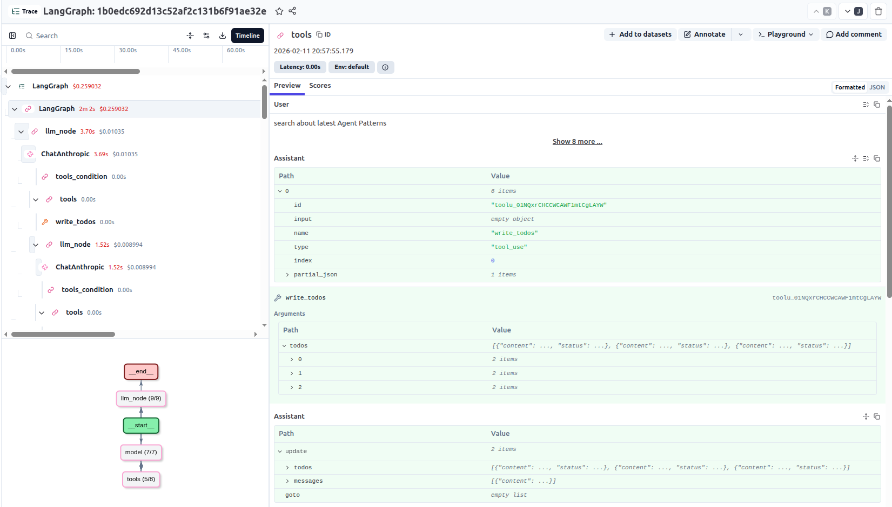

# Deep Agent

[](https://opensource.org/licenses/MIT)
[](https://www.python.org/downloads/)

## Overview

Deep Agent is an autonomous AI assistant built with [LangGraph](https://github.com/langchain-ai/langgraph). It excels at multi-step research tasks, breaking down complex questions into manageable sub-tasks and delegating them to specialized sub-agents. While it uses Claude Sonnet by default, it can be configured to work with any LLM supported by LangChain.

**Key capabilities:**
- Autonomous task decomposition and execution
- Research delegation with web search integration
- Todo management for tracking progress on complex tasks
- File system operations for reading and writing content



## Features & Architecture

### Features

- 🔍 **Research Sub-Agent** — Delegates research tasks to a specialized agent powered by Tavily search
- 📝 **Todo Management** — Creates and tracks task lists for multi-step operations
- 📁 **File System Tools** — Read, write, and list files in the workspace
- 📊 **Langfuse Observability** — Full tracing and monitoring of agent execution
- 🤖 **Think Tool** — Structured reasoning for complex problem-solving

### Architecture

```
┌─────────────────────────────────────────────────────────┐
│                    Main Agent (LLM)                     │
│                                                         │
│  ┌─────────────┐  ┌─────────────┐  ┌─────────────────┐  │
│  │ Todo Tools  │  │ File Tools  │  │ Research Agent  │  │
│  │             │  │             │  │                 │  │
│  │ • read      │  │ • ls        │  │ ┌─────────────┐ │  │
│  │ • write     │  │ • read_file │  │ │tavily_search│ │  │
│  │             │  │ • write_file│  │ │ think_tool  │ │  │
│  └─────────────┘  └─────────────┘  │ └─────────────┘ │  │
│                                    └─────────────────┘  │
└─────────────────────────────────────────────────────────┘
```

### Tech Stack

| Component | Purpose |
|-----------|---------|
| **[LangGraph](https://github.com/langchain-ai/langgraph)** | Agent orchestration framework — manages state, tool calls, and sub-agent delegation |
| **[Claude Sonnet](https://www.anthropic.com/)** | Default LLM — can be replaced with any LangChain-supported model (OpenAI, Gemini, etc.) |
| **[FastAPI](https://fastapi.tiangolo.com/)** | API server — exposes the LangGraph agent via REST endpoints with streaming support |
| **[Open WebUI](https://github.com/open-webui/open-webui)** | Chat interface — connects to the agent via a custom Pipe for a native UI experience |
| **[Langfuse](https://langfuse.com/)** | Observability platform — traces agent execution, tool calls, and sub-agent activity |
| **[Tavily](https://tavily.com/)** | Search API — provides web search capabilities for the research sub-agent |

## Prerequisites & Installation

### Prerequisites

- Python 3.11 or higher
- API keys:
  - **Anthropic** — For Claude model access
  - **Tavily** — For web search capabilities

### Installation

1. **Clone the repository**
   ```bash
   git clone https://github.com/yourusername/deep-agent.git
   cd deep-agent
   ```

2. **Create and activate a virtual environment**
   ```bash
   uv venv
   source .venv/bin/activate
   ```

3. **Install dependencies**
   ```bash
   uv sync
   ```

4. **Configure environment variables**

   Create a `.env` file in the project root:
   ```env
   ANTHROPIC_API_KEY=your_anthropic_key
   TAVILY_API_KEY=your_tavily_key

   # Langfuse (self-hosted via Docker Compose)
   LANGFUSE_SECRET_KEY=your_langfuse_secret_key
   LANGFUSE_PUBLIC_KEY=your_langfuse_public_key
   LANGFUSE_BASE_URL=http://localhost:3000
   ```

## Usage

### LangGraph CLI (Development)

Run the agent with LangGraph Studio for interactive development:

```bash
langgraph dev
```

This opens LangGraph Studio where you can interact with the agent and visualize execution.

### Docker Compose (Full Stack)

For a complete setup including Langfuse observability:

```bash
docker compose up -d
```

This starts:
- The Deep Agent API
- Langfuse (observability dashboard)
- PostgreSQL, Redis, ClickHouse, and MinIO (Langfuse dependencies)

Access Langfuse at `http://localhost:3000` to monitor agent traces.



## License

This project is licensed under the MIT License — see the [LICENSE](LICENSE) file for details.

## References

- [LangGraph Documentation](https://langchain-ai.github.io/langgraph/)
- [Anthropic Claude API](https://docs.anthropic.com/)
- [Tavily Search API](https://docs.tavily.com/)
- [Langfuse Documentation](https://langfuse.com/docs)
- [Open WebUI Documentation](https://docs.openwebui.com/)
- [FastAPI Documentation](https://fastapi.tiangolo.com/)
